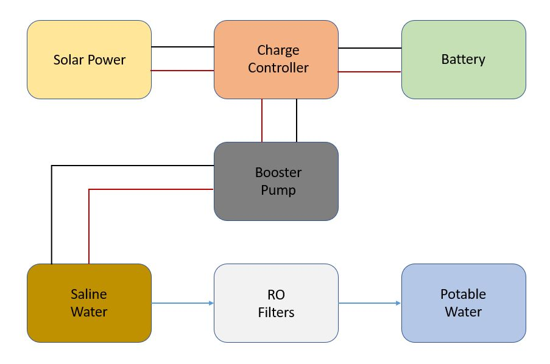
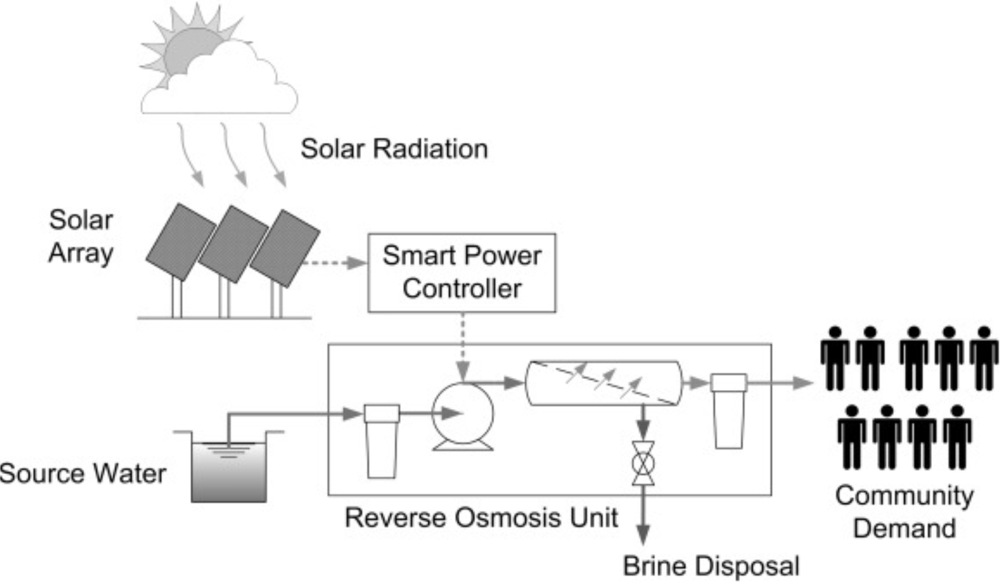

= Tribe D: Daringbaaz | Project DoXFroY | Requirements + Specifications + Design + Closure
:authors: Shubham Kumar, Harshita Badiyasar, Hemali Priyadarshi, Harsha Patnala
:lang: en
:toc:
:sectids:
:sectnums: all
:stem: asciimath
:stylesheet: styles.css
:revdate: 25-04-2023
:version: 4.1

== Document Statistics

=== Word Count
=== Readibility measures

.Readability indices value
[cols=">2, <7,3a, 4a",options="header",%autowidth.stretch,format=csv]

|===

Sl. No.,Index,Value,Range
1,Gunning Fog,0,0-20
2,Flesch Reading Ease,0,0-100
3,Coleman-Liau Index,0,0-(17+)
4,SMOG Index,0,3-

|===

== Team Details

.Detail of team members and their responsibilities
[cols=">2, <7, 5a, 7a, 5a,2a",options="header",%autowidth.stretch,format=csv]

|===

Sl. No.,Name,Entry,Email,Designation,I.F.
1,Shubham Kumar,2020EE30627,ee3200627@iitd.ac.in,Tribe Coordinator,1
2,Harshita Badiyasar,2020MT10807,mt1200807@iitd.ac.in,Sub-Coordinator,1
3,Hemali Priyadarshi,2020EE30597,ee3200597@iitd.ac.in,Sub-Coordinator,1
4,Shiva Kumar Vallala,2020MT10848,mt1200848@iitd.ac.in,Sub-Coordinator,0.9
5,Anmol S,2020EE10471,ee1200471@iitd.ac.in,Research,1
6,Harshita Kurre,2020EE30596,ee3200596@iitd.ac.in,Research,1
7,Kartikey Agarwal,2020EE10505,ee1200505@iitd.ac.in,Research,1
8,Mannepalli Chandra Sekhar,2020MT10818,mt1200818@iitd.ac.in,Research,1
9,Nishant Agarwal,2020MT10828,mt1200828@iitd.ac.in,Research,1
10,Priyanshu Sharma,2021MT10678,mt1200678@iitd.ac.in,Research,1
11,Rama Bharti,2020MT10834,mt1200834@iitd.ac.in,Research,1
12,Saksham Singh,2020MT10841,mt1200841@iitd.ac.in,Research,1
13,Sania Goyal,2020MT10842,mt1200842@iitd.ac.in,Research,1
14,Sanskriti Jain,2020MT60890,mt6200890@iitd.ac.in,Research,1
15,Shivang Agarwal,2020MT10849,mt1200849@iitd.ac.in,Research,1
16,Sheetal,2020MT10847,mt1200847@iitd.ac.in,Research,1
17,Simran Malik,2020MT10854,mt1200854@iitd.ac.in,Research,1
18,Subhan Akhtar,2019EE10533,ee1190533@iitd.ac.in,Research,1
19,Sunpreet Singh,2020MT10857,mt1200857@iitd.ac.in,Research,1
20,Volla Jayathi,2020MT60897,mt6200897@iitd.ac.in,Research,1
21,Yashwant Singh Kaurav,2020MT10864,mt1200864@iitd.ac.in,Research,1
22,Aditya Agrawal,2020EE30573,ee3200573@iitd.ac.in,Ideation,1
23,Bhavneek Singh,2020EE10482,ee1200482@iitd.ac.in,Ideation,1
24,Dheekshith Kumar,2020MT60876,mt6200876@iitd.ac.in,Ideation,1
25,Divyanshi Thaakur,2020EE11015,ee1201015@iitd.ac.in,Ideation,1
26,Harsh Kumar,2020MT60879,mt6200879@iitd.ac.in,Ideation,1
27,Harsha Patnala,2020MT10846,mt1200846@iitd.ac.in,Ideation,1
28,Harshit Goyal,2020MT10806,mt1200806@iitd.ac.in,Ideation,1
29,Ishaan Singhal,2019EE30574,ee3190574@iitd.ac.in,Ideation,1
30,Jaya Teja,2020MT60874,mt6200874@iitd.ac.in,Ideation,1
31,Keshav Ranjan,2020EE30602,ee3200602@iitd.ac.in,Ideation,1
32,Kishan Kumar Jangde,2020EE10506,ee1200506@iitd.ac.in,Ideation,1
33,Neeraj Sharma,2020MT60885,mt6200885@iitd.ac.in,Ideation,1
34,Prashant Kumar,2020EE10525,ee1200525@iitd.ac.in,Ideation,1
35,Praveen Singh,2020EE30616,ee3200616@iitd.ac.in,Ideation,0.9
36,Prisha Jain,2020MT60886,mt6200886@iitd.ac.in,Ideation,1
37,Priyansh Agrawal,2019EE30591,ee3190591@iitd.ac.in,Ideation,1
38,Raparthi Akshita,2020EE10538,ee1200538@iitd.ac.in,Ideation,1
39,Saurabh Dudhwal,2020MT10844,mt1200844@iitd.ac.in,Ideation,1
40,Shubham Kumar,2020EE10554,ee1200554@iitd.ac.in,Ideation,1
41,Srikanth R,2020EE10557,ee1200557@iitd.ac.in,Ideation,1
42,Varnika Bhatt,2020EE30630,ee3200630@iitd.ac.in,Ideation,1
43,Yishuvendra Kumar Devangan,2020EE30635,ee3200635@iitd.ac.in,Ideation,1
44,Pankaj Sharma,2020EE30610,ee3200610@ee.iitd.ac.in,Ideation,1
|===

== Project Workflow Design

== Abstract

In this document, we present to you some of the ideas we discussed to improve rural India, along with the requirements and specifications of each product. Some ideas we thought would be helpful are solar energy-supported water filtration systems, solar cookers, wind energy harvesting devices, and rechargeable batteries. We chose these ideas considering the requirements of people, the feasibility of these products, and the feasibility of using green energy to support these devices. The final demonstrable product we decided on is a solar energy-supported water filtration system. This is because the availability of clean drinking water is a significant problem in India. Not all villages can afford water treatment plants, mainly due to the cost of maintaining them. So we decided to reduce the cost by using solar energy. It is a one-time investment, and maintaining it is pretty simple.  Solar energy is also much cleaner than your usual conventional alternatives.  The document also explores the design and the working principle of this product including a block diagram.

== Background

One of the earliest mentions of  "do anything from anywhere" idea can be traced back to the Industrial Revolution, when the concept of working from home became popular among artisans and craftspeople who produced goods from their homes. However, this type of work was limited to those who had the skills and equipment necessary to produce goods independently.

The modern idea of "do anything from anywhere", which allows people to perform a variety of tasks from anywhere in the world, emerged in the late 20th century with the rise of telecommunications and the internet. In the 1970s, futurist Alvin Toffler predicted that technology would allow people to work from home and communicate with others around the world without leaving their desks.

In the 1980s, IBM became one of the first companies to adopt a remote work policy, allowing employees to work from home or other locations. Other companies followed suit, and the concept of remote work began to gain popularity.

So, there isn't one specific person who first talked about the idea of remote work as we know it today. Instead, it has evolved over time as technology has advanced and more people have recognized its benefits.

=== Why is DoXFroY necessary

The ability to "do anything from anywhere" has become increasingly important in recent years due to advances in technology and changes in the global economy.

Firstly, modern technology such as the internet, cloud computing, and mobile devices have made it possible to work and communicate from anywhere in the world. This has created new opportunities for businesses and individuals to work remotely, which can increase productivity, reduce costs, and provide greater flexibility.

Secondly, globalisation and the rise of the knowledge economy mean that many jobs and industries are no longer tied to a specific location. For example, a software developer can work from anywhere in the world as long as they have an internet connection and the necessary software tools. This has led to the growth of the gig economy and freelance work, which are often conducted remotely.

Thirdly, the COVID-19 pandemic has accelerated the adoption of remote work as a way for companies to continue their operations while keeping their employees safe. This has shown that remote work can be just as effective as traditional office-based work, and has led to many companies adopting hybrid work models that allow employees to work from anywhere.

In summary, the ability to "do anything from anywhere" has become necessary due to technological advancements, changes in the global economy, and the COVID-19 pandemic. It provides greater flexibility, increased productivity, and can reduce costs for businesses and individuals alike.

=== How DoXFroY can be converted into reality

The ability to "do anything from anywhere" is made possible by several factors, including infrastructure, technology, and government policies.

Infrastructure: To enable remote work, a reliable infrastructure is necessary, including access to high-speed internet, mobile networks, and other essential services. Many countries and regions have invested in expanding their infrastructure to support remote work, such as building fiber-optic networks or improving mobile network coverage in rural areas.

Technology: Modern technology such as cloud computing, video conferencing, and collaboration tools are essential for remote work. Advances in technology have made it possible to work and communicate from anywhere in the world, which has increased the popularity of remote work.

Government policies: Government policies can also play a role in enabling remote work. For example, some governments offer tax incentives or other benefits to companies that allow remote work or invest in digital infrastructure. Additionally, policies such as flexible working hours or remote work arrangements can help to facilitate remote work.

Cultural acceptance: In some places, cultural attitudes towards remote work may play a role in its adoption. For example, in some countries, there is a strong cultural emphasis on working in a traditional office environment. However, as the benefits of remote work become more widely recognized, attitudes are shifting, and more people are embracing the idea of working remotely.

In summary, to enable remote work, a combination of infrastructure, technology, government policies, and cultural acceptance is necessary. As these factors continue to evolve and improve, the ability to "do anything from anywhere" will become increasingly accessible to people around the world.

 
== Introduction

DoXFroY means *Do* anything(*X*) **Fro**m anywhere(*Y*). With the advent of technologies, communication, transportation, and innovation have become easier with time. People living in metropolitan areas are able to access the necessary commodities and are benefitting from it, but in stark contrast is the picture in rural areas where in some places electricity and internet technologies are yet to reach. Even in metropolitan areas, it is not that the living conditions of people are good at all places. People have to toil hard to maintain their living standards in thosecostly cities. There is a dire need for systemic level changes and technological innovations which will make it easier for people to do their work and avail the necessary services from anywhere. This solution should also be devised keeping in mind its sustainability. The following project is a step further in that direction. We are trying to find possible interventions and changes which would drive the future in the direction of making DoXFroY culture ubiquitous and sustainable.

== Requirements

To make the culture of the future DoXFroY, we think the following are the systemic changes and technological interventions which are needed:

=== Ideas

==== Solar Cooker

In India's rural areas, the concept of a solar cooker might be used to offer a viable and reasonably priced method of preparing meals.  
Remote area cooking : In isolated locations with scant or no access to power or cooking fuel, meals can be cooked using solar cookers. This may lessen the need for conventional cooking fuels like firewood, which can destroy forests and contribute to air pollution.
 
Community kitchens: Hot meals might be served to people in far-off places using solar cookers. In places with no separate homes or where people live near to one another, this could be extremely helpful.
 
Disaster Assistance: People afflicted by natural disasters or other situations may receive hot meals thanks to the usage of solar cookers in disaster relief initiatives. Solar cookers may be used even in places without access to electricity or gas because they don't need any additional fuel sources.
 
Micro-enterprises: In isolated locations, the usage of solar cookers may present potential for micro-enterprises. Solar cookers might be used by neighborhood business owners to set up tiny eateries where they could provide hot meals or sell snacks to the locals.

==== Network of Health Centers

The hospitals are concentrated in towns and it is not possible for people to approach them and they have to sometimes wait for getting necessary health services. In DoXFroY society, people should be able to avail health-related assistance and even emergency services from remote places without much delay. To make this idea a reality, a network of healthcare experts, nurses, doctors, and volunteers needs to be there spread throughout the geography of India which is a distributed network. There would be an app through which people in need of assistance would ask for help and the doctor in the vicinity of the person would get the signal and respond to it. If she comes to conclude that she needs certain blood units, medicines, vials of ointments, etc., she can contact it a nearby storehouse that will dispatch the necessary items with the help of drones to the destination upon receiving a request signal.

A network of healthcare workers and centers could play a crucial role in enabling people to access medical treatment from anywhere in India. Here are some possible interventions that could be implemented through such a network - 

===== Telemedicine services

Healthcare professionals and facilities might provide telemedicine services to patients in far-off places with the use of internet access. Patients might virtually chat with medical specialists, get advice from them, and even get medicines online.

===== Remote patient sensing

Healthcare professionals and facilities might follow the health of patients with chronic diseases or those who require after surgery care using remote monitoring technologies. Patients might submit their health information to healthcare providers using wearable technology or other remote monitoring tools so that they can monitor the patient's status and take appropriate action if necessary.

===== Mobile medical clinics

With the right tools and resources, medical personnel may go to far-flung locations in mobile clinics. These clinics could give basic medical treatment, carry out diagnostic procedures, or even perform small surgeries.

===== Medical supply chain management

Hospitals and other healthcare facilities might employ technology to control the flow of medical supplies and equipment. This can entail keeping track of the stock of medical equipment, ordering, and sending supplies to far-off places, and making sure that the apparatus is maintained and fixed as required.

In general, a network of medical professionals and facilities might be extremely important in ensuring that residents of remote locations have access to high-quality medical treatment. Healthcare services might be provided more effectively and efficiently by utilizing technology and innovation, aiding in closing the access divide between urban and rural healthcare.

==== Project Paramarth

People need help sometimes with their work or with their chores. Old people face difficulty in getting some of their work done and might need care as they might be helpless at times with nobody to care for around them. Some people might be seeking some friend to whom they can talk and share some moments so that they do not feel lonely. If we can create a network where people can raise a help request and the potential helpers living in the vicinity might receive it and respond to it then the community would be a much better place to live in. We can give tokens to people who are helping others and one might have to expend some of them to get help. We can also provide extra tokens to old age people or to helpless people.

==== Grievance redressal system and crowdsourcing information from people

A grievance redressal system could be set up to address issues faced by citizens in accessing basic services or in using the DoXFoY initiative. This system could include a helpline number, online platform, or mobile application where citizens can register their grievances and track their progress. The system could also be integrated with government agencies or service providers to ensure that complaints are resolved in a timely and effective manner.

Crowdsourcing information from citizens could help to identify the needs and concerns of people living in remote areas. This could be done through surveys, focus groups, or social media platforms. The information gathered could be used to inform the development of new services or technologies as part of the DoXFoY initiative. Also, community feedback mechanisms could be established to encourage citizen participation and engagement. This could include town hall meetings, community forums, or feedback boxes located in public places. These mechanisms could provide a platform for citizens to voice their concerns, provide feedback on existing services, and suggest new ideas for the DoXFoX initiative.

==== Biogas Plant

The idea of a biogas plant could be used to provide sustainable energy solutions in remote areas of India. It could be beneficial in the following ways –

===== Cooking fuel 

Biogas plants could be used to provide cooking fuel in remote areas where there is limited or no access to electricity or cooking gas. The biogas produced from the plant could be used in stoves or burners for cooking, replacing traditional cooking fuels such as firewood or charcoal. This can help reduce deforestation and indoor air pollution.

===== Electricity Generation

Biogas plants can also be used to generate electricity in remote areas where there is no access to the grid. The electricity generated can be used for lighting, powering appliances, or even for running small businesses. This can provide a sustainable and affordable energy source for people living in these areas.

===== Waste management 

Biogas plants can be used to manage organic waste, such as food waste, animal waste, or agricultural waste. The waste is fed into the plant, where it is broken down by bacteria to produce biogas and organic fertilizer. This can help reduce the amount of waste that ends up in landfills, and provide a valuable source of fertilizer for agricultural use.

===== Employment Opportunities 

The establishment and maintenance of biogas plants can create employment opportunities in rural areas. Local entrepreneurs could set up and run biogas plants, providing a valuable service to the community while also generating income.

==== Rechargeable battery 

Electricity in rural areas of India is not present for 24x7 and the problem of power cut hinders technological adoption by the people living in those areas. People also have difficulties while working at night and have to rely on kerosene lamps and wicks for lighting their houses at night. Can we make a light bulb that is able to store energy when there is electricity and thus light up when it is dark during a power cut? The rechargeable bulb can be designed to charge from solar energy also.

The idea of a rechargeable battery can be used in various ways as part of the DoXFoX initiative to provide sustainable and affordable energy solutions in remote areas of India. Here are some ways in which rechargeable batteries can be used - 

===== Off-grid electricity

Rechargeable batteries can be used to store electricity generated from renewable sources such as solar panels or wind turbines. This stored energy can then be used to power homes, appliances, or small businesses, providing a sustainable and reliable off-grid electricity solution.

===== Electric vehicles

Rechargeable batteries can also be used in electric vehicles, providing a sustainable and clean mode of transportation. This can be particularly useful in rural areas where transportation options are limited.

===== Backup power

Rechargeable batteries can be used as backup power sources in case of power outages. This can be particularly useful in areas where power outages are frequent, and can help ensure that critical services such as healthcare facilities and communication networks remain operational.

==== Wind energy harvesting devices

Small wind turbines can be installed in remote areas to generate electricity. These turbines can be used to power homes, schools, health clinics, or small businesses, providing a sustainable and reliable off-grid electricity solution. Small wind turbines can also be used in combination with other renewable energy sources such as solar panels to provide a hybrid energy system. Portable wind turbines can also be used to provide electricity in areas where there is no access to electricity, or where access is limited. These turbines can be set up in minutes and can be used to power small devices such as phones, laptops, or lamps.

Wind energy can be used to power water pumps in remote areas, providing a sustainable and reliable source of water. This can be particularly useful in areas where access to clean water is limited.

==== Embedding QR code with necessary information 

The use of QR codes as part of the DoXFoY initiative can help improve access to information and services in remote areas of India, making it easier for people to access the information they need to make informed decisions about their health, education, finances, and more. Here are some ways in which QR codes can be used - 

===== Healthcare information

QR codes can be used to provide healthcare information to patients in remote areas. For example, a QR code can be embedded on a medication package, which, when scanned, provides information about the medication, dosage, side effects, and instructions for use. This can help improve patient safety and reduce the risk of medication errors.

===== Agricultural information

QR codes can be used to provide agricultural information to farmers in remote areas. For example, a QR code can be embedded on a seed package, which, when scanned, provides information about the seed, planting instructions, and recommended fertilizers. This can help improve crop yield and reduce waste.

===== Education information

QR codes can be used to provide education information to students in remote areas. For example, a QR code can be embedded on a textbook, which, when scanned, provides additional information, videos, or interactive learning activities. This can help improve the quality of education and make learning more engaging and interactive.

===== Financial information

QR codes can be used to provide financial information to people in remote areas. For example, a QR code can be embedded on a bank account statement, which, when scanned, provides information about account balances, transactions, and interest rates. This can help improve financial literacy and enable people to make better financial decisions.

In the context of updating books, QR codes can be used to provide readers with access to a range of information related to the book, such as:

Updated text: QR codes can be used to provide updated text for a chapter or section of the book that needs to be corrected.

Multimedia content: QR codes can be used to provide multimedia content such as videos, audio recordings, or images that supplement the book content

Additional resources: QR codes can be used to provide links to additional resources such as websites, articles, or research papers related to the book content

Author information: QR codes can be used to provide readers with information about the author or the publishing house, including their contact information, social media profiles, and other relevant details

Feedback mechanism: QR codes can be used to provide readers with a feedback mechanism where they can send their comments, questions, or suggestions related to the book content.

Overall, the information embedded in QR codes will depend on the purpose and context of the book and the type of updates required. QR codes provide a flexible and easy-to-use mechanism for delivering updated information and enhancing the reading experience

=== The requirements of the product

==== QR code stickers

When designing QR codes to embed in books, it is important to consider the following characteristics:

Size: The size of the QR code should be large enough to ensure that it can be easily scanned by a smartphone or tablet, but not so large that it takes up too much space on the book

Contrast: The QR code should have a high contrast with the background on which it is printed to ensure that it can be easily scanned

Error correction: The QR code should have error correction capabilities, which can help to ensure that the code can be accurately scanned even if it is partially damaged or obscured

Encoding: The QR code should be encoded with the appropriate information, including links, text, or other relevant data

Testing: The QR code should be thoroughly tested to ensure that it can be accurately scanned by a variety of devices and under different lighting conditions

Accessibility : It is also important to ensure that the QR code is placed in a location that is easily visible and accessible to readers, and that it does not interfere with the readability or usability of the book

Additionally, it is important to make sure that the QR code sticker is securely attached to the book and will not fall off or become damaged over time
 

==== Development of human resources

The development of human resources is a key aspect of the DoXFoX initiative and can help bring about systemic changes to the way we live, work and access basic needs in India. Education and training programs can be developed to equip people with the necessary skills and knowledge to participate in the digital economy and take advantage of remote work opportunities. This can help bridge the skills gap and improve access to quality education in remote areas. Programs can be developed to promote entrepreneurship and help people start their own businesses. This can help create new economic opportunities and reduce the dependence on traditional employment options.

Mentorship programs can be developed to connect experienced professionals with young people in remote areas. This can help provide guidance and support to those who are just starting their careers and create new networking opportunities. Efforts can be made to improve access to information and knowledge-sharing platforms for people in remote areas. This can help bridge the digital divide and promote the sharing of ideas and best practices.
Thus, by investing in education, training, entrepreneurship development, capacity building and mentorship programs, we can help create a more equitable and sustainable society.

==== Solar-powered water filter

The idea of a solar-powered water filter can be a great solution for providing clean drinking water in remote areas of India where access to clean water is limited. Here are some ways in which a solar-powered water filter can be used as part of the DoXFoX initiative:

Water treatment: A solar-powered water filter can use solar energy to power the filtration process and remove impurities from the water, providing safe and clean drinking water. This can help improve health outcomes and reduce the incidence of water-borne illnesses in remote areas.

Community water supply: A solar-powered water filter can be used to set up a community water supply system. This can help provide clean drinking water to a larger number of people in the community, improving their quality of life and reducing the burden of water collection.

Agriculture: A solar-powered water filter can be used to purify water for agricultural purposes. This can help improve crop yields and food security in remote areas where access to water is limited.

== Specifications

=== Constraints placed on certain ideas

==== QR Code 

There are several potential problems with embedding QR codes in books to provide updated information: 

Dependence on Technology: The idea assumes that everyone has access to a smartphone or device that can scan the QR code, which may not be the case for everyone. This could create a digital divide and limit the accessibility of the updated information. 

Privacy Concerns: QR codes may collect data about the user's device or location, and there is a risk of the user's personal data being compromised. This may discourage some people from scanning the codes, and in turn, they would miss out on the updated information. 

Compatibility: Not all QR codes are compatible with all devices or scanning applications. This could lead to frustration and confusion for users who are unable to access the updated information. 

Cost: Embedding QR codes in books may increase the production cost of the book, which could make it more expensive for consumers to purchase. 

Updating QR codes: In order to keep the QR codes updated, the book publisher or author would need to continually update the information on the code, which could be time-consuming and expensive. This may not be feasible for all publishers or authors. 

Updating the information linked to the QR codes would require a system to manage the updates, including changes in the information and the QR code itself. This could require specialized software to maintain and update the database of QR codes and the linked information. 

Complexity: Implementing a system for managing QR codes and their associated information could be complex, requiring specialized skills and knowledge to set up and maintain. 

Systematic level testing : this would not be possible within the small time frame available. We would require many books to be updated with QR codes over a small period of time (which is not possible), as it would generally require more than 2-3 years to incorporate such changes in all books across India.  

==== Rechargeable battery: 

Hardware limitations: The development of such a rechargeable bulb would require the integration of a battery, solar panel, and a control circuit into the bulb. Designing such a product would require significant hardware expertise, and sourcing components could be a challenge. 

Technical challenges: Developing a rechargeable light bulb that is affordable, durable, and efficient in storing energy could be technically challenging, requiring specialized skills and knowledge in materials science, electronics, and renewable energy. Knowledge of materials science is one thing that we don’t have much expertise in. 

Infrastructure challenges: Deploying the rechargeable light bulb on a large scale would require significant investments in infrastructure, including solar panels, batteries, and distribution networks, which may be difficult to establish in remote rural areas. It is beyond our current scope to make infrastructural modifications to already existing systems. 

Cost: The rechargeable light bulb may be more expensive than traditional light bulbs, making it difficult for low-income households to adopt the technology. (One time expense of buying a rechargeable bulb can be greater than that of the traditional bulbs, even though in the long run the rechargeable ones might prove to be more economical) 

Systematic changes: The deployment of rechargeable light bulbs on a large scale would require changes in the way electricity is generated, distributed, and consumed, which may be difficult to implement and require the cooperation of multiple stakeholders, including government agencies, utilities, and communities. 

Environmental concerns: The production and disposal of rechargeable light bulbs may have environmental impacts, and the use of solar panels may require the extraction of rare metals and minerals, which can have negative environmental consequences. 

Time constraints: Even if we were to try and implement this project, due to the time constraints, we wouldn’t be able to complete it, thus we had to drop it 

Testing: The testing of this idea would require some sample space (in terms of a community/village), and we did not have this for testing the efficiency and usefulness of our idea 

==== Wind Energy Harvesting devices 

Dependence on Wind Velocity: Wind energy harvesting devices require a minimum wind velocity to generate electricity. If the wind speed falls below a certain level, the device will not be able to generate any electricity. Similarly, if the wind velocity is too high, it can damage the device. 

Location-specific: The efficiency of wind energy harvesting devices largely depends on the location. The device needs to be placed in an area with high wind velocity, which may not always be possible. Also, areas with high wind velocity may be prone to extreme weather conditions such as hurricanes and tornadoes, which can damage the device. We did not have access to such a location to test our product hence the idea was dropped. 

Noise Pollution: Wind energy harvesting devices produce noise while in operation. This can be a problem if the device is installed in a residential area where noise pollution is not tolerated. 

Bird and Wildlife Collisions (Environmental concerns): Wind turbines can cause harm to birds and other wildlife that fly into them. This can affect the local ecosystem and biodiversity. 

Maintenance and Durability: Wind energy harvesting devices require regular maintenance to ensure optimal performance. They can also be damaged by extreme weather conditions such as high winds and lightning strikes. Therefore, the materials used for building the device must be durable enough to withstand such conditions. 

Visual Impact: Wind turbines can also have a significant visual impact, which can be seen as a disadvantage by some people. This can affect the aesthetics of the surrounding area and reduce property values. 

==== Solar Cooker 

Cost: Solar cookers can be expensive to manufacture or purchase, particularly if high-quality materials are used. This may make them less accessible to low-income households, which may be the target audience for our project. 

Technical challenges: Solar cookers require specific technical expertise to manufacture, install, and maintain. This may be a challenge for our team, as we do not have access to specialized knowledge or equipment. 

Infrastructural challenges: Solar cookers require consistent sunlight to operate effectively. This may be a challenge in areas with high levels of cloud cover or frequent rain. Additionally, households may require significant infrastructural changes, such as the installation of solar panels or the modification of cooking spaces, to use solar cookers effectively. 

Systemic level challenges: Implementing solar cookers would require systemic changes at a larger scale, including changes in cooking habits and traditions. Changing cooking habits and traditions would require a change in the mindset and behavior of the community. This is a systemic challenge that requires a multi-dimensional approach and may take considerable time to achieve as it involves educating and raising awareness among the community 

==== Development of human resources 

Systemic level changes: The idea of developing human resources such as Anganwadi and ASHA workers requires systemic changes in policy, funding, and implementation. This may be difficult to achieve within the limited scope of our project. 

Resource-intensive: Developing human resources can be a resource-intensive process that requires significant investment in training, infrastructure, and personnel. This may not be feasible within the constraints of our project. 

Limited impact: While Anganwadi and ASHA workers have had a positive impact in rural areas, there may be limits to their effectiveness. For example, there may be constraints on their time, resources, and ability to reach all households. 

Lack of expertise: Developing human resources may require specialized expertise in areas such as training, curriculum development, and program management. We may not have the necessary expertise within our team to effectively implement this idea. 

Time constraints: Developing human resources is a long-term process that may take several months or even years to achieve. Given the time constraints of our project, it may not be practical to pursue this idea within the given timeline. 

==== Pedal Power Generator 

Cost: Pedal power generators can be expensive to manufacture or purchase, particularly if high-quality materials are used. This may make them less accessible to low-income households, which may be the target audience for our project. 

Complexity: A pedal power generator is a complex system that requires technical knowledge to design and maintain. This may pose a challenge for individuals and communities with limited access to technical education and training. 

Technical challenges: Pedal power generators require specific technical expertise to manufacture, install, and maintain. This may be a challenge for our team, as we do not have access to specialized knowledge or equipment. 

Infrastructural challenges: Pedal power generators require consistent physical effort to operate effectively. This may be a challenge for some households, particularly if they have limited access to food, water, or other resources required for sustained physical exertion. Additionally, households may require significant infrastructural changes, such as the installation of generators or the modification of electrical systems, to use pedal power generators effectively. 

Systemic level challenges: Pedal power generators may require systemic changes to be effective. For example, they may require changes to the existing electrical grid or energy policies to ensure that households can effectively sell or distribute the excess electricity they generate. These challenges may be difficult to overcome within the given constraints of our project. 

Safety concerns: Pedal power generators may pose safety risks, particularly if not designed and maintained correctly. This could lead to injuries and accidents, which could undermine the effectiveness of the solution. 

Time constraints: Developing and testing a pedal power generator prototype would require significant time and resources, which may not be feasible within our project's timeline. 

==== Solar Powered Water Filter

Hardware product preferred over software product: We decided to go with a hardware product instead of a software product as we wanted to make a tangible impact on people's lives. A solar-powered water filter is a physical product that can be installed in rural areas to provide clean drinking water to people. 

Technical feasibility: The solar-powered water filter is technically feasible and does not require complex installation or maintenance. It is a simple device that can be installed and used easily. 

Cost-effective: The solar-powered water filter is cost-effective and has a lower cost of installation and maintenance compared to wind energy harvesting devices. 

Time constraints: The solar-powered water filter is a product that can be developed and installed in a relatively short amount of time. It is a practical solution that can be completed within the given time frame of our project. 

 
==== Project Paramarth 

Resource constraints: The project requires a sufficient number of volunteers and helpers to work effectively. Lack of volunteers in certain areas could limit the reach of the project. 

Technology constraints: The project requires the development of an online platform or app to connect volunteers and helpers. This requires technical skills and resources, as well as ongoing maintenance and updates. 

Privacy and security concerns: The project involves the collection and sharing of personal information, which raises privacy and security concerns. The project must ensure that personal information is kept confidential and secure. Because for example if a theif gets the information about a old people who live alone they can attack on their home0000 

Accessibility constraints: The platform must be accessible to everyone, regardless of their age, gender, or physical ability. This requires the design of an easy-to-use interface and consideration of accessibility features for people with disabilities. 

Systemic level changes: Some ideas, such as implementing a government policy to incentivize volunteering, require systemic-level changes that are beyond the scope of the project. 

Software vs hardware debate: The choice between developing a web-based platform or a mobile application requires careful consideration of user preferences and limitations in terms of device compatibility and connectivity 

Time constraints: Certain ideas, such as the installation of a biogas plant, require significant time and resources that may not be feasible within the project timeline. The project must prioritize ideas that can be implemented within the given timeframe. 

 
==== Biogas Plant 

Location Constraint: The biogas plant takes a significant amount of space and also location specific.

Cost: Implementing a biogas plant may be expensive, requiring significant investment in equipment, infrastructure, and maintenance. 

Time: Setting up a biogas plant could be time-consuming, requiring the installation of equipment, the development of infrastructure, and the training of personnel. 

Maintenance: Biogas plants require ongoing maintenance to operate efficiently, which could be costly and time-consuming. This could be a significant constraint for communities with limited resources. 

 
Technical expertise: Biogas plants require specialized technical expertise to operate and maintain, which may not be available in all communities. 

Environmental impact: Biogas plants can produce odors, noise, and waste products, which may be a concern for nearby residents. Proper environmental safeguards and mitigation measures would need to be put in place to address these concerns. 

Hardware vs. software debate: Biogas plants involve both hardware (such as tanks and pipes) and software (such as control systems and monitoring software). Choosing the right mix of hardware and software could be a constraint, as it would require balancing technical and financial considerations. 

Time-limit: Setting up a biogas plant would require a significant investment of time, which may not be feasible within a short time frame. This could be a constraint for communities with urgent needs for energy or waste management solutions. 

==== Network of Health Centers

Accessibility: While the network of healthcare professionals and volunteers would increase accessibility to health-related assistance, there may still be areas that are difficult to reach due to remote locations or lack of infrastructure. This could limit the effectiveness of the network in helping those in need. 

Dependence on Technology: The idea relies heavily on technology, specifically the app and drones, to dispatch necessary items. This may not be feasible in areas with limited access to technology or internet connectivity, which could limit the reach of the network. 

Privacy Concerns: The app would collect personal data from users, such as location and medical history, which could be a concern for some users. There is a risk of the user's personal data being compromised, which could discourage some people from using the app. 

Cost: Establishing and maintaining a network of healthcare professionals, nurses, doctors, and volunteers would require significant resources and funding. Additionally, the cost of deploying drones for delivery could be high, which could limit the scalability of the network. 

Infrastructure: The effectiveness of the network would be limited by the availability of necessary infrastructure, such as medical supplies and equipment, and transportation infrastructure for the drones. 

Systemic Level Changes: The idea of a distributed network of healthcare professionals, nurses, doctors, and volunteers may require systemic-level changes in the healthcare system, which could be difficult to implement in practice. 

Time Constraints: The establishment of the network and the deployment of the necessary technology and infrastructure would require significant time and resources, which could limit the feasibility of the idea in the short term. 

== Specifications

=== Rechargeable battery

Type: Lithium-ion

Capacity: 3000 mAh

Voltage: 3.7 V

Charging time: 4-5 hours

Discharging time: 8-10 hrs

=== Wind energy harvesting devices

Rated power output: 1-5kW

Rotor diameter: 2-4 metres

Cut-in wind speed: 3-4 m/s

Rated wind speed: 10-12 m/s

Cot-out wind speed: 20-25 m/s

=== Solar-powered Water Filter

Filter type: Reverse osmosis

Filtration rate: 5-10 liters/hour

Power source: Solar panel with battery backup

Material: Stainless steel frame with polypropylene filters

UV sterilization: not included

=== Embedding QR code with necessary information

QR code size: 1 inch x 1 inch

Information stored: Website URL, contact details, product details

Compatible devices: Smartphones and tablets with QR code readers

=== Biogas plant

Feedstock: Cow dung, poultry waste, agricultural waste

Capacity: 5-10 cubic meters

Gas output: 1-2 cubic meters per day

Digester material: Fiberglass reinforced plastic

Gas utilization: Cooking, lighting, heating

== Design

=== Components

==== Solar panel

A solar panel is a crucial part of a solar water filtration system that provides a sustainable and reliable power source for the system to function. To construct a cost-effective solar water filtration system, it is necessary to consider the specific needs and resources of the user and select affordable, locally available materials such as PVC pipes, sand, gravel, activated carbon, and a plastic water tank. Once the filtration system is built, the solar panel should be mounted on a sturdy frame or structure in an area that receives maximum sunlight exposure. A charge controller, battery, and pump should be connected to the solar panel to ensure a consistent flow of power.

A well-built and maintained solar water filtration system provides an affordable and sustainable solution for accessing clean and safe drinking water while reducing reliance on traditional energy sources. Regular maintenance and cleaning of the filtration system are essential to ensure its long-term efficiency and effectiveness. Overall, constructing a solar water filtration system is a practical and cost-effective way to provide access to safe drinking water, especially in areas with limited access to electricity and clean water sources.

We would be using this website https://grabcad.com/library/mini-solar-module-for-electronics-1 as our inspiration to design and properly assemble CAD models for a solar panel. 

==== Battery 

A rechargeable battery is a type of energy storage device that can store electricity from a solar panel or another power source. In a solar water filtration system, a rechargeable battery is used to store the energy generated by the solar panels during the day, which can be used to power the filtration system at night or during periods of low sunlight. This is used in a solar water filtration system and is typically a deep-cycle battery, which is designed to provide a steady and consistent flow of power over an extended period of time. Deep-cycle batteries are different from traditional car batteries, which are designed to provide a high burst of power for short periods.

The most common type of rechargeable battery used in solar water filtration systems is a lead-acid battery. These batteries are reliable and cost-effective, making them a popular choice for off-grid applications.

The battery is usually connected to the solar panel and the booster pump through a charge controller, which regulates the flow of power to the battery and prevents overcharging or discharging. The charge controller also ensures that the battery is charged efficiently and prolongs its lifespan. The size and capacity of the rechargeable battery depend on the size of the solar water filtration system and the amount of power needed to operate the pump and other components. Larger systems may require multiple batteries or higher-capacity battery to ensure reliable operation.

==== RO membrane

Reverse osmosis(RO) is a water purification technology that uses a semipermeable membrane to remove ions, molecules, and larger particles from water. The RO membrane used in a solar water filtration system is a critical component that separates clean water from the feed water. RO membranes are made of a thin layer of semi-permeable material, typically made from cellulose acetate, polyamide, or polysulfone. The membrane has a dense layer that acts as a barrier to the contaminants while allowing water molecules to pass through. This filtration process occurs under pressure, which forces the water through the membrane, leaving behind any impurities.

In a solar water filtration system, the RO membrane works in conjunction with a solar-powered pump and a series of pre-filters to purify water from sources such as rivers, lakes, or groundwater. The system works by using the energy from the sun to power the pump, which pulls water from the source and pushes it through the pre-filters and the RO membrane. The resulting purified water is then collected in a storage tank for later use.

==== Booster pump

A booster pump is an electrically powered device that helps increase the pressure of water flowing through a system.
Solar panels used for water filtration typically require a certain level of pressure to function effectively.
If the pressure is too low, the solar panels may not be able to filter water efficiently, reducing their overall effectiveness.
A booster pump can help increase the pressure of water flowing through the system, ensuring that the solar panels are able to operate at their optimal level.
The booster pump can be installed in line with the solar panel system, helping to push water through the system at a higher pressure.
Depending on the specific system, a booster pump may need to be sized appropriately to ensure it can provide the necessary pressure.

==== Solenoid valve

A solenoid valve is an electrically controlled valve that is used to regulate the flow of fluid, such as water, in a plumbing system.

Solenoid valves consist of a coil of wire that, when energized, creates a magnetic field that opens or closes a valve mechanism.
In the context of filtering water through solar panels, solenoid valves can be used to control the flow of water in and out of the panels.

This allows the system to be automated so that water is only allowed to flow through the panels when needed, and not continuously.

This can help to optimize the system's efficiency, by reducing the amount of water that needs to be pumped through the panels, and by preventing water from overheating in the panels when they are not in use.

Solenoid valves can also be used to control the direction of water flow, so that water can be diverted away from the panels when they need to be cleaned or maintained.

Assembly of a solenoid valve which we are trying to make : https://wicvalve.com/15-Inch-Electric-General-Purpose-Air-Water-Solenoid-Valve-NC-2BCW-1-1-2-D.htm

=== Working Principle

The process of movement of solvent (water, in this case),  through a semipermeable membrane from the solution (unpurified water) to the pure solvent by applying excess pressure on the solution side, to overcome osmotic pressure is called Reverse Osmosis (RO). In the normal osmosis process, which is driven by chemical potential differences of the solvent, a thermodynamic parameter, the water moves from low solute concentration to high solute concentration. In the RO process, the movement is in the opposite direction. In RO desalination almost all (around 95 to 99%) dissolved salts are filtered into the rejected stream, and solar-powered RO desalination can reduce or interrupt the dependency on conventional energy fossil fuels, reduces additional costs and results in environmental safety with sustainability and a disease-free community. A solar PV module (a series connected sufficient number of solar cells to provide required standard output voltage and power) can be used to act as a power supply for operating functions for desalination, such as a booster pump to pressurise the water flow into RO desalination elements through a rack of vessels containing semi-permeable membranes.

=== Block Diagram

.Block diagram of solar-powered water filter

=== Process

Solar PV module extracting solar energy whenever available and storing it in a battery. This energy is then used to purify water. In our design, water (unpurified) from a natural source flows through the hoses as shown in the figure, and is pumped through the filtration membrane (RO Unit) which provides purified water at the other end of the membrane where it is stored. The purified water can now be extracted through a tap and used for drinking, dish washing etc.

.Schematic diagram showing the working mechanism of the device

=== Evaluation criteria of the project

Water can be exposed to contamination risks from agricultural, industrial, and domestic activities, which may include many types of pollutants such as heavy metals, pesticides, fertilizers, hazardous chemicals, and oils.

Physical Parameters: Turbidity, Total Solids, Colour, Electrical Conductivity

Turbidity: Due to suspended particles in the water. 

Turbidity is measured by an instrument called nephelometric turbidimeter, which expresses turbidity in terms of NTU or TU. A TU is equivalent to 1 mg/L of silica in suspension. Turbidity more than 5 NTU can be visible to the average person while turbidity in muddy water, it exceeds 100 NTU

Total Solids: Total solid(TS)=Total dissolved solid(TDS)+Total suspended solid(TSS)

Water can be classified by the amount of TDS per liter as follows:

a. Freshwater: <1500 mg/L TDS;

b. Brackish water: 1500–5000 mg/L TDS;

c. Saline water: >5000 mg/L TDS.

Taste and odour: Can be caused by foreign matter such as organic materials, inorganic compounds, or dissolved gasses. They are measured using a threshold value, and must be below a specified limit.

Electrical Conductivity: Pure water is not a good conductor of electricity. Typical conductivity of water is as follows:

a. Ultra-pure water: 5.5 × 10^−6 S/m;

b. Drinking water: 0.005–0.05 S/m;

c. Seawater: 5 S/m.

Chemical Parameters:

a. pH: While 7 pH indicates neutral (neither acidic nor basic), safe ranges of pH for drinking water are from 6.5 to 8.5 for domestic use and living organisms need. Depending on the exact purpose of the filtered water, the allowable range of pH can vary.
   
b. Fluoride: 1 – 1.4 mg/L in warmer climates. Up to 2.4 mg/L is allowed in colder climate.

c. Fe: < 0.2 ppm

d. Mn: < 0.05 ppm

e. Al: < 0.2 ppm

f. Cu: < 3.0 ppm

g. Zn: < 5.0 ppm

h. Cd: < 0.005 ppm

i. Residual Cl2 : 2 mg/L

Other anions like Cl-, SO42-, NO3- also must be less than a prescribed limit, but they are much less toxic

Toxic organic substances like benzenoids are carcinogenic, must ensure that these are absent

Radioactive substances: They too can cause serious illness, must check that these are of the order of picocurie per Litre.

Dissolved Oxygen: This is an important metric for the water in streams, lakes, ponds. The higher the concentration of dissolved oxygen, the better the quality of water.

a. BOD – measures the oxygen consumption of the living beings(microbes) in the water

b. COD – measures all the organic (oxidisable) substances present 

=== Scope of the project

These are the techniques that can be added to the project:

UV filtration: UV filtration can be added to the project to further purify the water. UV filtration uses ultraviolet light to kill bacteria and viruses, making it an effective method for water treatment.The effectiveness of UV filtration depends on several factors, including the intensity of the UV light, the exposure time of the water to the UV light, and the water quality. The water must be pre-treated to remove any particles or debris that could block the UV light from reaching the microorganisms in the water.

Pre filtration: pre-filtration techniques such as activated carbon or sediment filters, which can remove impurities like chlorine, sediment, and volatile organic compounds (VOCs) before the water enters the reverse osmosis membrane.

Storage tank: incorporating a storage tank with the system can help in providing a continuous supply of purified water even when the sun is not shining.

Mineralization: Reverse osmosis removes minerals from the water, which can lead to taste issues and potential health problems. Mineralization can add back the essential minerals like calcium and magnesium to improve the taste and make the water healthier to drink.

pH adjustment: Reverse osmosis can also cause the water to become slightly acidic. pH adjustment can help bring the water to a more neutral level, making it more pleasant to drink and reducing the risk of corrosion in pipes.

Monitoring and control system: Adding a monitoring and control system to the project can help in ensuring the proper functioning of the system. This can include sensors to measure water quality, pressure, and flow rates, as well as a control panel to adjust system settings and track performance.

Remote monitoring: Remote monitoring can be added to the system to allow for real-time monitoring and control from a remote location. This can be useful in situations where the system is located in a remote or hard-to-reach area.

Energy storage: Incorporating energy storage, such as batteries, can help in providing a continuous supply of purified water even when the solar power is not available. This can be particularly useful in areas with limited sunlight or during cloudy weather.

Mobile unit: Designing the system as a mobile unit can allow it to be easily transported to areas where access to clean water is limited, such as disaster-stricken areas or refugee camps. This can help in providing immediate relief to those in need.

== Product Development

== Challenges

Reverse osmosis water purification with solar electricity can be a practical method for supplying clean drinking water in off-grid remote places. To make this approach possible and effective, though, a number of issues must be resolved. Some of these difficulties include:

=== Energy requirements

Reverse osmosis requires a lot of energy to operate, and solar power may not always be able to supply the system with the energy it needs. The amount of energy needed can change based on the water source's quality, the system's capacity, and the surrounding conditions.

=== Water quality

Although reverse osmosis can effectively remove a variety of pollutants, including germs and viruses, it might not be able to remove all of them. To ensure that the water satisfies the necessary quality standards, pre-treatment of the water may be necessary.

=== Membrane fouling

Reverse osmosis systems might lose efficiency as a result of clogged membranes caused by impurities over time. In places with large concentrations of dissolved solids or organic materials, this may be a particular issue.

=== Maintenance

Reverse osmosis systems fueled by solar must undergo routine maintenance to keep working properly. In remote locations where qualified specialists might not be easily accessible, this can be difficult.

=== Cost

Reverse osmosis systems that run on solar energy can be pricey to construct and operate. Some groups, especially those in developing countries, may find the cost of the system to be prohibitive.

=== Water scarcity

Reverse osmosis systems might not be a good option in places with a limited supply of water because they need a lot of water to run and maintain them.

To ensure that solar-powered reverse osmosis systems are long-lasting and efficient in supplying clean drinking water to underserved populations, these issues must be addressed. This will take a mix of technical know-how, financial commitment, and community involvement.

== Discussion and Future Work

As a team, our work was related to DoXFroY because we followed a problem-solving approach that focused on the needs of specific communities. We sought to understand the challenges and problems faced by these communities and designed solutions that met their unique requirements. This approach enabled us to create impactful and sustainable solutions that were tailored to the needs of the beneficiaries.

To make DoXFroY a reality, several actions can be taken. First, there needs to be a shift in mindset among individuals and organizations, where they prioritize the needs of the end-users or beneficiaries. This can be achieved by promoting empathy, encouraging active listening, and fostering cross-cultural understanding.

Second, there needs to be more collaboration and partnerships between different stakeholders, including governments, non-profits, and the private sector. These partnerships can help leverage resources, expertise, and knowledge to develop more impactful and sustainable solutions.

Third, education and training programs can be developed to promote the DoXFroY approach among individuals and organizations. This can include courses on design thinking, empathy, and human-centered design, among others.

Finally, systemic level changes are needed to create an environment that supports the development and implementation of DoXFroY initiatives. This can include policy changes, funding mechanisms, and regulatory frameworks that prioritize social impact and innovation. By creating an enabling environment, systemic level changes can help to promote and scale the adoption of DoXFroY in different sectors and industries.

In conclusion, making DoXFroY a reality requires a combination of individual, organizational, and systemic level changes. By adopting a DoXFroY approach, we can design and develop innovative solutions that are more effective, impactful, and sustainable, and that meet the unique needs of the communities we are trying to serve.

== Conclusion

Our project aimed to address the problem of clean drinking water scarcity in rural India using a sustainable and affordable solution. We identified the need for a solar energy-supported water filtration system and ideated a prototype to meet the requirements of the communities. However, we also recognized the challenges and limitations of implementing such a solution and identified areas for future work. 

Our project was aligned with the DoXFroY approach, which prioritizes the needs of the end-users and focuses on developing impactful and sustainable solutions. We believe that by adopting this approach, we can design and develop innovative solutions that are more effective, impactful, and sustainable and that meet the unique needs of the communities we are trying to serve. 

In conclusion, our project highlights the importance of community-driven problem-solving and the potential of sustainable solutions to address critical social and environmental issues. We hope that our work can inspire others to adopt a similar approach and contribute to creating a more equitable and sustainable world.

== Glossary

BOD = Biological oxygen demand

COD = Chemical oxygen demand

DoXFroY = *Do* anything(*X*) **Fro**m anywhere(*Y*)

I.F. = Involvement Factor

RO = Reverse Osmosis

TDS = Total Dissolved Solid

TS = Total Solid

TSS = Total Suspended Solid

URL = Uniform Resource Locator

== References

[1] Y. Wong, "_Scalable, Solar Powered Membrane-Based Water Purification Systems for Community Development in Developing Countries_", Embry-Riddle Aeronautical University - Daytona Beach.

[2] S. Prakash, "_Solar Energy Based Water Purification System_", International Research Journal of Engineering and Technology, vol. 8, no. 6, pp. 3415-3419, 2021.

[3] K. Dikgale, D.F. Ntobela, B.G.V. Mendes, L.K. Tartibu, T.J. Kunene, and E. Bakaya-Kyahurwa, "_Development of solar-powered water purification systems_", in Proceedings of the 9th International Conference on Appropriate Technology, Tshwane University of Technology, Pretoria, November 2020, pp. 900-919.

[4] B. Sreewirote, N. Suttisinthong, and A. Ngaopitakkul, "_The Application of Solar Cells for Water Filtration System_", MATEC Web of Conferences, vol. 260, pp. 03002, 2019.

[5] X. Xu, S. Ozden, N. Bizmark, C.B. Arnold, S.S. Datta, and R.D. Priestley, "_A bioinspired elastic hydrogel for solar-driven clean water purification_", Harvard Medical School Science in the News, April 2021.

[6] A. Carlson, R. Kiriu, A. Nosé, C. Sugii, E. Taketa, and A. Tamai, "_Solar powered water purification system_" Mechanical Engineering Senior Theses, no. 9, Santa Clara University, 2012. [Online]. Available: https://scholarcommons.scu.edu/mech_senior/9

[7] P. J. Edla, N. Sonkar, B. Gupta, and V. Kumar, "_Solar Water Purifier For Indian Villages – A Review_", in Proceedings of the International Conference on Recent Advances in Engineering and Technology (ICRAET), Jabalpur Engineering College, Jabalpur, India, March 2016, pp. 224-227.

[8] J. Alward and R. Ayoub, "_Water requirements and remote arid areas: the need for small-scale desalination_", Desalination, vol. 107, pp. 131-147, 1996.

[9] K. A. E. Keith and J. J. French, "_Design and testing of a remote deployable water purification system powered by solar energy_", Advances in Technology Innovation, vol. 4, no. 1, pp. 30-36, 2019

[10] A. I. Wibowo and K. C. Chang, "_Provision of clean water in remote village/islet through solar energy application: case of Indonesia_", in Proceedings of the 2019 IEEE 3rd International Conference on Green Energy and Applications (ICGEA), Taiyuan, China, March 16-18, 2019, pp. 193-198

[11] WHO and UNICEF, "_Progress on drinking water, sanitation and hygiene: 2017 update and SDG baselines_", WHO & UNICEF, Geneva, Switzerland, 2017

[12] R. M. Dahekar, A. Farsole, K. Pusadkar, M. Saini, S. Darwai, and S. Hinge, "_Water purification system powered by solar energy_", in Proceedings of the 2018 International Conference on Energy, Communication, Data Analytics and Soft Computing (ICECDS), Chennai, India, February 15-17, 2018, pp. 1683-1687

